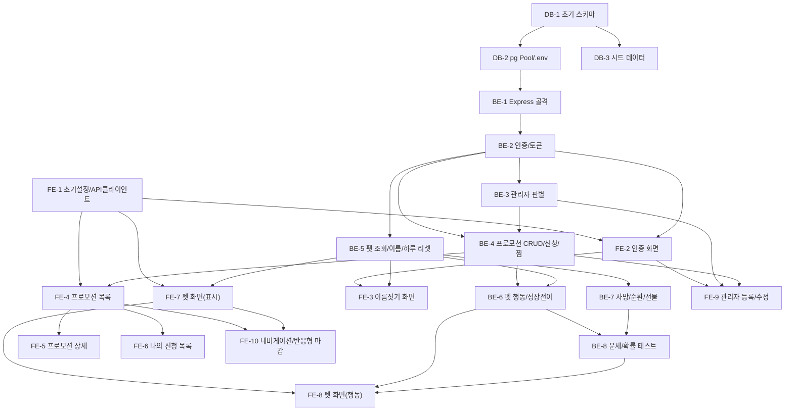

# 실행계획: b2b-promo

기반 문서: `1-domain-definition.md`, `2-pet-design-guide.md`, `3-PRD.md`, `4-use-case-diagram.md`, `5-user-scenarios.md`, `6-project-principle.md`, `7-arch-diagram.md`, `8-wireframe.md`, `9-erd.md`, `9-schema.sql`
전제: 1인 개발, 3일 일정, 오버엔지니어링 금지(`CLAUDE.md`). 문서에 없는 기능·인프라는 추가하지 않는다. 기술 스택은 PRD 4장 그대로(React 19 + Zustand + TanStack Query / Node.js + Express + pg / PostgreSQL 17 / JWT 액세스+리프레시).

Task 총 21개: DB 3개, BE 8개, FE 10개.

---

## DB (데이터베이스)

### DB-1. 초기 스키마 마이그레이션 작성
- `9-schema.sql`(users, refresh_tokens, promotions, applications, favorites, pets)을 `backend/src/db/migrations/001_init.sql`로 그대로 옮겨 배치한다.
- `9-schema.sql` 내용을 변경하지 않는다(제약조건으로 이미 1:1, 중복신청 방지, 찜 복합키가 해결되어 있으므로 앱 코드 검증을 추가하지 않는다).
- 로컬 PostgreSQL 17에 실제로 적용해 테이블 6개가 생성되는지 확인한다.
- 선행: 없음
- 완료 조건:
  - [x] `backend/src/db/migrations/001_init.sql` 파일이 `9-schema.sql`과 동일한 내용으로 생성되어 있다.
  - [x] 로컬 DB에 마이그레이션을 실행해 `users/refresh_tokens/promotions/applications/favorites/pets` 6개 테이블이 정상 생성된다.

### DB-2. pg 연결 풀 모듈 및 환경변수 정의
- `backend/src/db/pool.js`에 `pg.Pool`을 생성하고 export하는 모듈을 작성한다(`DATABASE_URL` 환경변수 사용).
- `backend/.env.example`에 `DATABASE_URL`, `JWT_ACCESS_SECRET`, `JWT_REFRESH_SECRET`, `PORT` 최소 목록을 정의한다(`6-project-principle.md` 5장).
- 선행: DB-1
- 완료 조건:
  - [x] `pool.js`가 `DATABASE_URL`로 연결되는 `pg.Pool` 인스턴스를 export한다.
  - [x] `.env.example`에 4개 변수가 모두 정의되어 있고 실제 시크릿 값은 커밋되지 않는다.

### DB-3. 관리자 계정 및 샘플 프로모션 시드 데이터
- 단일 관리자 계정 1개(이메일 화이트리스트 판정에 쓸 이메일)와 샘플 프로모션 2~3건(진행중 1건, 기간종료 1건 포함, 각각 다른 특식 표현용 `special_food_id`)을 넣는 시드 SQL(`backend/src/db/seed.sql`)을 작성한다.
- 회원가입 API로 만들 수 없는 초기 데이터(관리자 계정 비밀번호 해시, 샘플 프로모션)만 시드에 담고, 그 외 새 테이블/컬럼은 만들지 않는다.
- 선행: DB-1
- 완료 조건:
  - [x] `seed.sql` 실행 시 관리자 계정 1개와 프로모션 2~3건(기간종료 포함)이 삽입된다.
  - [x] 실제로 로컬 DB에 적용해 `SELECT`로 데이터가 보이는 것을 확인했다.

---

## BE (백엔드)

### BE-1. Express 앱 골격 및 공통 에러 처리
- `backend/src/app.js`(미들웨어 등록, 라우트 마운트), `backend/src/server.js`(listen)를 작성한다.
- `backend/src/middleware/error.middleware.js`에 공통 에러 핸들러를 만들어 모든 에러 응답을 `{ error: { code, message } }` 형태로 통일한다(`6-project-principle.md` 7장).
- 선행: DB-2
- 완료 조건:
  - [ ] `node backend/src/server.js`로 서버가 기동되고 지정된 `PORT`에서 응답한다.
  - [ ] 존재하지 않는 라우트나 강제로 던진 에러가 `{ error: { code, message } }` 형식으로 응답된다.

### BE-2. 인증 도메인 (회원가입/로그인/토큰)
- `backend/src/services/auth.service.js`: 이메일/비밀번호 회원가입(bcrypt 해시), 로그인, 가입 시 펫 1마리 자동 생성(`stage='알'`, `activity_count=0`), 액세스 토큰(15분)/리프레시 토큰(14일) 발급, 리프레시 토큰으로 액세스 토큰 재발급.
- `backend/src/middleware/auth.middleware.js`: `Authorization: Bearer` 액세스 토큰 검증, 만료 시 401, `req.user` 세팅.
- `backend/src/controllers/auth.controller.js`, `backend/src/routes/auth.routes.js`: 회원가입/로그인/토큰재발급 엔드포인트. 리프레시 토큰은 httpOnly 쿠키로 저장.
- 발급한 리프레시 토큰은 `refresh_tokens` 테이블에 해시로 저장하고, 재발급 시 저장된 해시와 대조한다. 로그아웃은 해당 행을 DELETE 해서 즉시 무효화한다(PRD 5.1절).
- 선행: DB-1, BE-1
- 완료 조건:
  - [ ] 회원가입 API 호출 시 users 레코드와 pets 레코드(알 상태)가 함께 생성된다.
  - [ ] 로그인 성공 시 액세스 토큰(Body/헤더)과 리프레시 토큰(httpOnly 쿠키)이 발급되고, `refresh_tokens`에 해시 1건이 저장된다.
  - [ ] 로그아웃 호출 시 해당 `refresh_tokens` 행이 삭제되어 같은 리프레시 토큰으로 재발급이 실패한다.
  - [ ] 액세스 토큰 없이 보호된 API 호출 시 401이 반환되고, 만료된 액세스 토큰은 리프레시 엔드포인트로 재발급된다.

### BE-3. 관리자 판별 처리
- 단일 관리자 계정 판별 로직을 추가한다(예: 환경변수 또는 화이트리스트로 관리자 이메일 지정, `req.user.email` 비교). 별도 role 테이블/권한 엔진은 만들지 않는다(`6-project-principle.md` 5장).
- 프로모션 등록/수정 라우트에서만 이 판별을 사용하는 간단한 미들웨어(`requireAdmin`)로 구현한다.
- 선행: BE-2
- 완료 조건:
  - [ ] 관리자 이메일로 로그인한 사용자만 `requireAdmin`을 통과한다.
  - [ ] 관리자가 아닌 사용자가 등록/수정 API를 호출하면 403이 반환된다.

### BE-4. 프로모션 도메인 (목록/상세/등록·수정/신청/찜)
- `backend/src/services/promotion.service.js`: 목록/상세 조회, 등록/수정(관리자, title/기간/content/specialFoodId), 신청(기간 내 검증, 중복 신청은 DB UNIQUE로 처리 후 에러 매핑), 찜 토글.
- 신청 처리는 `pool.connect()` + `BEGIN/COMMIT/ROLLBACK` 트랜잭션으로 감싼다(신청 레코드 생성이 곧 특식 보유 판정 기준이 되므로 별도 보유 테이블은 만들지 않는다 — 보유 특식 목록은 `applications JOIN promotions`로 조회).
- `backend/src/controllers/promotion.controller.js`, `backend/src/routes/promotion.routes.js` 작성.
- 선행: BE-2, BE-3
- 완료 조건:
  - [ ] 목록/상세 조회 API가 정상 동작한다.
  - [ ] 관리자만 등록/수정 API를 호출할 수 있다.
  - [ ] 기간이 지난 프로모션 신청 시 에러가 반환되고, 동일 프로모션 중복 신청 시 에러가 반환된다.
  - [ ] 찜 토글 API가 즉시 반영되고(행 생성/삭제), 신청 완료된 프로모션은 "보유 특식 조회"에 포함된다.

### BE-5. 펫 조회 및 이름 짓기, 로그인 연동 하루 리셋
- `backend/src/services/pet.service.js`에 `getPet`, `nameOwnPet`(이름 짓기/재설정), `resolveMoodOnLogin`(자정 기준 KST로 "마지막 갱신일 != 오늘"이면 mood/eggState 랜덤 재설정 및 접속횟수 카운트, lazy 처리, 별도 배치 없음) 함수를 작성한다.
- 로그인 흐름(BE-2 `auth.service.js`의 로그인 처리)에서 `resolveMoodOnLogin`을 호출하도록 연결한다.
- `backend/src/controllers/pet.controller.js`, `backend/src/routes/pet.routes.js`에 펫 조회/이름짓기 엔드포인트 추가.
- 선행: BE-2
- 완료 조건:
  - [ ] 로그인 API 호출 시 당일 최초 로그인이면 mood(또는 eggState)가 랜덤 재설정되고, 같은 날 재로그인 시 유지된다.
  - [ ] 이름 짓기 API로 이름을 설정/변경할 수 있고, 건너뛰면 기본 이름이 표시된다.
  - [ ] 하루 3회 이상 접속 시 mood가 "행복"으로 바뀐다.

### BE-6. 펫 행동 처리 (목욕/밥/특식주기/쓰다듬기, 성장 전이)
- `pet.service.js`에 `applyAction(action)`(목욕/밥/쓰다듬기 - 도메인 정의서 5.1 표대로 mood/eggState 개선), `feedSpecialFood(promotionId)`(보유 특식 급여: 요청중이면 무지개, 자발적이면 10%→50/50 특수효과), `checkStageTransition`(알→새끼, 새끼→성체, activityCount 조건 충족 시 50% 판정)을 구현한다.
- 확률 계산은 `Math.random`을 인자로 주입 가능하게 만들어(BE-8 테스트에서 시드 대체 가능하도록) 한 곳에만 둔다.
- `pet.routes.js`/`pet.controller.js`에 목욕/밥/특식주기/쓰다듬기 엔드포인트 추가. "밥"과 "특식 주기"는 완전히 분리된 엔드포인트/버튼으로 유지한다.
- 선행: BE-4(보유 특식 조회), BE-5
- 완료 조건:
  - [ ] 알 단계에서 목욕/밥/특식주기/쓰다듬기 호출 시 도메인 정의서 5.1 표대로 eggState와 activityCount가 변한다.
  - [ ] 새끼/성체 단계에서 동일 행동이 mood를 표대로 변화시키고 "밥"은 특식 효과가 전혀 없다.
  - [ ] activityCount가 전이 조건(2회/누적5회)을 충족하면 50% 확률로 다음 단계로 성장하고, 실패해도 activityCount는 유지된다.
  - [ ] 특식 요청 상태에서 대상 특식 급여 시 무지개로 변하고, 자발적 급여 시 10% 확률로만 특수효과(50% 진화/50% 반짝이)가 발생한다.

### BE-7. 사망/성체 순환/선물 지급 로직
- `pet.service.js`에 `checkDeathOrCycle`(로그인 시점에 lastActiveAt 기준 7일 미접속이면 사망 우선 적용 → 묘비, 다음 로그인 시 새 알 교체 및 activityCount/이름 초기화; 성체가 stageChangedAt 기준 2주 경과 시 새 알 남기고 순환 + 선물 100%)와 `maybeGrantGift`(성체 접속 시 5% 확률 + lastGiftAt 3일 쿨다운)를 구현한다.
- 이 판정들도 로그인 처리(BE-5 `resolveMoodOnLogin`과 같은 흐름)에서 한 번에 호출되도록 연결한다.
- 선행: BE-5
- 완료 조건:
  - [ ] 7일 이상 미접속 후 로그인하면 stage가 "묘비"이고, 그 다음 로그인에서 새 알로 교체(activityCount=0, name=null)된다.
  - [ ] 사망 조건과 성체 순환 조건이 동시에 충족되면 사망이 우선 적용된다.
  - [ ] 성체 순환(2주 경과) 시 확률과 무관하게 선물이 100% 지급되고 새 알로 교체된다.
  - [ ] 성체 접속 시 5% 확률로만 선물이 지급되고, 마지막 지급 후 3일 이내면 지급되지 않는다.

### BE-8. 오늘의 운세 엔드포인트 및 확률 로직 테스트
- `pet.service.js`에 `getTodayFortune`(새끼/성체 전용, 하루 1회 랜덤 문구, 같은 날 재요청 시 동일 결과 유지) 추가하고 라우트/컨트롤러에 연결한다.
- `6-project-principle.md` 4장 지침대로 확률/분기 로직만 테스트한다: 성장 전이 50%, 특식 요청 대상 선정 70% 가중치, 자발적 급여 10%→50/50, 성체 선물 5%+3일 쿨다운, 사망 vs 성체순환 우선순위. `Math.random`을 주입/모킹해 분기별 결과만 검증(통계적 반복 검증은 만들지 않음).
- 선행: BE-6, BE-7
- 완료 조건:
  - [ ] 오늘의 운세 API가 새끼/성체에서만 동작하고, 하루 내 재호출 시 같은 결과를 반환한다.
  - [ ] 위 5개 확률/분기 로직에 대해 각각 최소 1개 이상의 테스트가 통과한다.

---

## FE (프론트엔드)

### FE-1. 프로젝트 초기 설정 및 API 클라이언트
- Vite + React 19 프로젝트를 `frontend/`에 구성하고 라우터(react-router 등 문서에 명시된 범위 내 최소 구성)로 `App.jsx`에 페이지 라우트 골격(로그인/목록/상세/나의신청/펫)을 만든다.
- `frontend/src/api/client.js`: axios 인스턴스 + 인터셉터(액세스 토큰 자동 첨부, 401 시 리프레시 토큰으로 재발급 후 재시도).
- 선행: 없음
- 완료 조건:
  - [ ] `npm run dev`로 앱이 기동되고 빈 페이지 라우트 5개(로그인/목록/상세/나의신청/펫)로 이동이 가능하다.
  - [ ] `client.js`가 액세스 토큰을 자동으로 Authorization 헤더에 붙이고, 401 응답 시 리프레시를 시도한다.

### FE-2. 인증 화면 및 상태
- `frontend/src/api/auth.api.js`, `frontend/src/hooks/useAuth.js`(TanStack Query), `frontend/src/store/auth.store.js`(Zustand, 로그인 사용자 정보만).
- `frontend/src/pages/LoginPage.jsx`: 이메일/비밀번호 입력, 로그인/회원가입 폼 전환(같은 화면), 로그인 성공 시 최초 로그인 여부에 따라 펫 이름 짓기 화면 또는 목록 화면으로 이동(`8-wireframe.md` 1번).
- 선행: BE-2, FE-1
- 완료 조건:
  - [ ] 회원가입 후 자동 로그인되고 목록 화면 또는 이름 짓기 화면으로 이동한다.
  - [ ] 로그인 성공 시 Zustand 스토어에 사용자 정보가 채워지고, 실패 시 에러 메시지가 표시된다.

### FE-3. 펫 이름 짓기 화면
- `frontend/src/pages/`에 이름 짓기 화면(선택 입력 + 건너뛰기/확인 버튼, `8-wireframe.md` 2번)을 만들고, 최초 로그인/사망 후 새 알/성체 순환 후 새 알 상황에서 노출되도록 연결한다.
- 선행: BE-5, FE-2
- 완료 조건:
  - [ ] 이름을 입력하고 확인하면 펫 이름이 반영된 상태로 목록 화면으로 이동한다.
  - [ ] 건너뛰기를 누르면 기본 이름으로 목록 화면으로 이동한다.

### FE-4. 프로모션 목록 화면
- `frontend/src/api/promotion.api.js`, `frontend/src/hooks/usePromotions.js`(목록 useQuery), `frontend/src/hooks/useToggleFavorite.js`(useMutation).
- `frontend/src/pages/PromotionListPage.jsx`, `frontend/src/components/promotion/PromotionCard.jsx`, `frontend/src/components/promotion/FavoriteButton.jsx`: 특식 이모지+제목/기간/내용 요약, 찜 토글, 기간종료 시 "담당자에게 연락 주세요" 안내(`8-wireframe.md` 3번).
- 좁은 화면 1열 / 넓은 화면 그리드는 CSS만으로 처리(컴포넌트 분기 없음).
- 선행: BE-4, FE-1
- 완료 조건:
  - [ ] 프로모션 목록이 카드 형태로 렌더링되고 찜 버튼이 즉시 토글된다(리스트 재조회 없이 낙관적 갱신 또는 재조회 중 하나로 반영).
  - [ ] 기간 종료된 프로모션은 신청 버튼이 비활성화되고 안내 문구가 표시된다.
  - [ ] 브라우저 폭을 좁혔을 때 1열, 넓혔을 때 그리드로 재배치된다.

### FE-5. 프로모션 상세 화면
- `frontend/src/pages/PromotionDetailPage.jsx`, `frontend/src/hooks/useApplyPromotion.js`(useMutation): 제목/기간/내용 + 찜 토글 + 신청 버튼(신청 완료 시 상태 표시로 전환, `8-wireframe.md` 4번).
- 선행: FE-4

- 완료 조건:
  - [ ] 상세 화면에서 신청 버튼 클릭 시 신청이 완료되고 버튼이 "신청 완료" 표시로 바뀐다.
  - [ ] 이미 신청했거나 기간이 종료된 프로모션은 신청 버튼이 비활성화되고 안내 문구가 표시된다.

### FE-6. 나의 신청 목록 화면
- `frontend/src/pages/MyApplicationsPage.jsx`: 신청한 프로모션 카드 목록(제목/신청일/기간), 취소 버튼 없이 안내 문구만 표시(`8-wireframe.md` 5번).
- 선행: FE-4
- 완료 조건:
  - [ ] 로그인한 사용자가 신청한 프로모션만 목록에 표시된다.
  - [ ] 취소 버튼은 없고 "취소는 담당자에게 연락 주세요" 문구가 표시된다.

### FE-7. 펫 화면 - 상태 표시
- `frontend/src/api/pet.api.js`, `frontend/src/hooks/usePet.js`(펫 조회 useQuery).
- `frontend/src/pages/PetPage.jsx`, `frontend/src/components/pet/PetView.jsx`: `stage/mood/eggState/earType`에 따라 `2-pet-design-guide.md` 기준 베이스+오버레이 스프라이트를 분기 렌더(하나의 컴포넌트, 잘게 쪼개지 않음). 이름/상태, 일상 대사 말풍선, 묘비 상태 문구 표시(`8-wireframe.md` 6번).
- 선행: BE-5, FE-1
- 완료 조건:
  - [ ] 펫의 stage/mood(또는 eggState)에 맞는 스프라이트와 대사가 화면에 표시된다.
  - [ ] 묘비 상태일 때 "자주 오세요..." 메시지가 표시된다.

### FE-8. 펫 화면 - 행동 버튼
- `frontend/src/hooks/usePetAction.js`(목욕/밥/특식주기/쓰다듬기/운세 useMutation), `frontend/src/components/pet/PetActionButtons.jsx`: 목욕/밥/쓰다듬기 3버튼 + "밥" 클릭 시 기본주식/특식주기 하위 메뉴 + 특식주기 시 보유 특식 목록에서 선택 + 오늘의 운세 버튼(새끼/성체 전용, `8-wireframe.md` "밥"/"특식 주기" 하위 화면).
- 선행: BE-6, BE-8, FE-7
- 완료 조건:
  - [ ] 목욕/밥/쓰다듬기 버튼 클릭 시 펫 상태가 갱신되어 화면에 반영된다.
  - [ ] 보유 특식이 없으면 "특식 주기"가 비활성화되고, 있으면 목록에서 선택해 급여할 수 있다.
  - [ ] 오늘의 운세 버튼은 알 단계에서 비활성/미노출이고, 새끼/성체에서만 결과가 표시된다.

### FE-9. 관리자 프로모션 등록/수정 화면
- 와이어프레임 문서에는 없으나 PRD 3.1·5.2절 범위인 관리자 CRUD를 위한 최소 폼 화면을 추가한다(별도 관리자 레이아웃 없이, 관리자 계정으로 로그인 시에만 노출되는 페이지 1개: 제목/기간/내용/특식 입력 + 등록/수정 목록).
- 새 컴포넌트 체계나 별도 관리자 레이아웃은 만들지 않고 기존 페이지 구조에 페이지 1개만 추가한다.
- 선행: BE-3, BE-4, FE-2
- 완료 조건:
  - [ ] 관리자 계정으로 로그인했을 때만 등록/수정 화면 진입이 가능하다.
  - [ ] 폼으로 프로모션을 등록/수정하면 목록 화면에 즉시 반영된다.

### FE-10. 공통 네비게이션 및 반응형 마감
- 상단 네비게이션(나의 신청 목록 / 펫 보기 축소판 버튼)을 공통 레이아웃으로 두고 좁은 화면에서는 아이콘 위주, 넓은 화면에서는 가로 나열되도록 CSS를 정리한다(`8-wireframe.md` 3번 네비게이션 규칙).
- 전체 페이지(목록/상세/나의신청/펫)를 실제 모바일 폭과 데스크톱 폭에서 확인해 레이아웃 깨짐을 마감한다.
- 선행: FE-4, FE-7
- 완료 조건:
  - [ ] 모든 화면에서 상단 네비게이션으로 목록/펫 화면 간 이동이 가능하다.
  - [ ] 좁은 화면과 넓은 화면 각각에서 레이아웃이 깨지지 않고 문서에 정의된 배치대로 보인다.

---

## 전체 Task 의존 순서

### 실행 순서 요약
1. DB-1 → DB-2, DB-3
2. BE-1 → BE-2 → BE-3, BE-5
3. BE-4(BE-2·BE-3 이후) → BE-6(BE-4·BE-5 이후) → BE-8
4. BE-7(BE-5 이후) → BE-8
5. FE-1 → FE-2(BE-2 이후) → FE-3(BE-5 이후)
6. FE-1 → FE-4(BE-4 이후) → FE-5, FE-6
7. FE-1 → FE-7(BE-5 이후) → FE-8(BE-6·BE-8 이후)
8. FE-2·BE-3·BE-4 → FE-9
9. FE-4·FE-7 → FE-10 (마지막 마감 작업)
