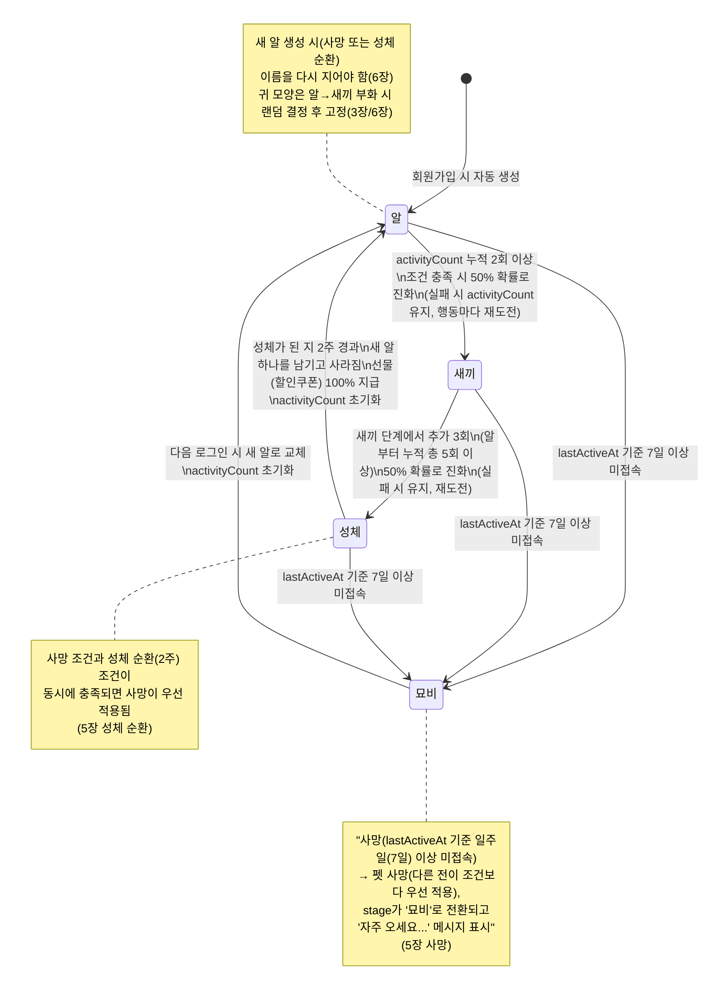
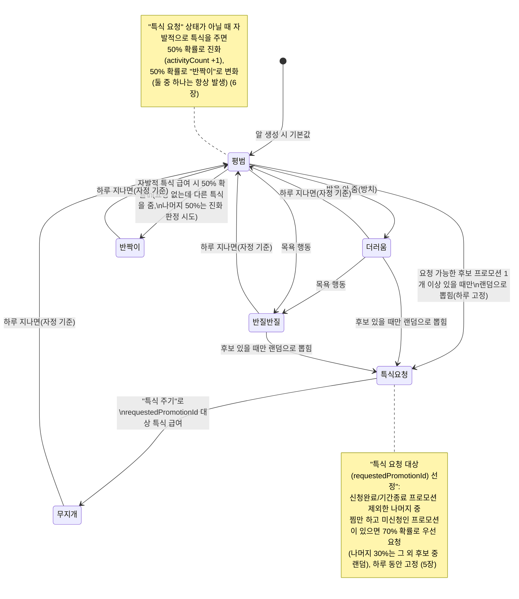
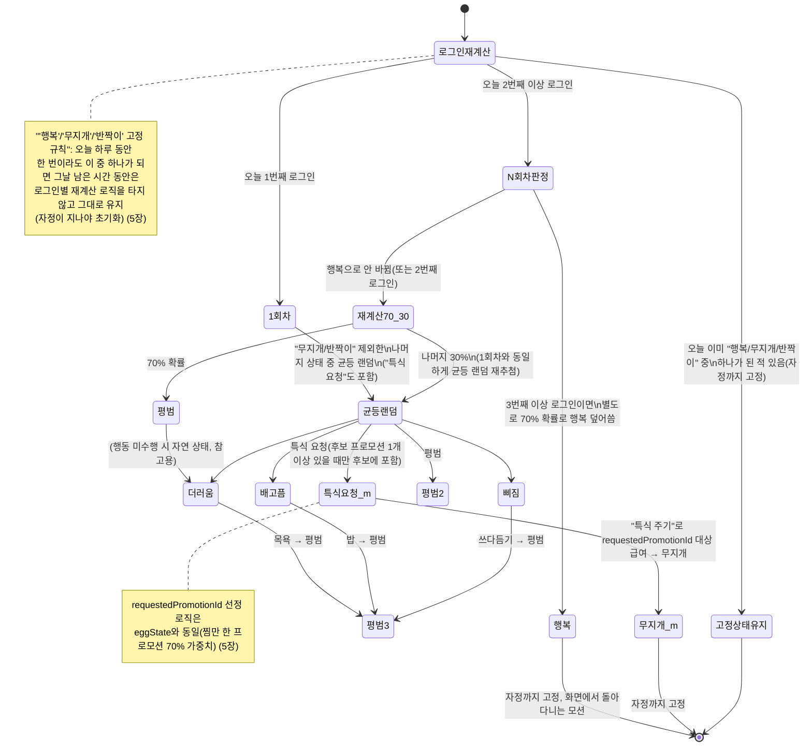
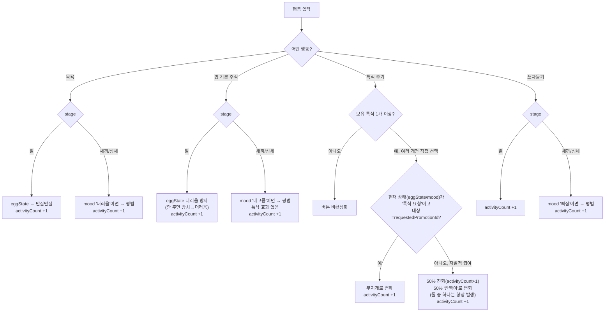

# 펫(다마고치) 상태 다이어그램

> 본 문서는 `docs/1-domain-definition.md`(도메인 정의서) 3장(Pet 엔티티), 5장(상태), 6장(비즈니스 규칙)에 정의된 규칙만을 시각화한다. 새로운 규칙이나 수치는 추가하지 않았으며, 정의서 문구를 그대로 인용한 부분은 note로 표시했다.

## 1. 성장 단계(stage) 상태 다이어그램

근거: 도메인 정의서 3장(Pet.stage, activityCount, stageChangedAt, lastActiveAt), 5장 "성장 단계 전이" · "성체 순환" · "사망"

## 2. 알 상태(eggState) 상태 다이어그램

근거: 도메인 정의서 3장(Pet.eggState), 5.1절, 5장 "알 상태(eggState) 전이"

## 3. 기분(mood) 상태 다이어그램

근거: 도메인 정의서 3장(Pet.mood), 5장 "기분(mood) 전이" (새끼/성체 단계 전용)

## 4. 행동별 효과 요약 (도메인 정의서 5.1절)

근거: 도메인 정의서 5.1절 "단계별 행동·상태 정리" 표, 5장/6장 특식 규칙

| 단계 | 목욕 | 밥(기본 주식, 쌀밥) | 특식 주기 | 쓰다듬기 |
|---|---|---|---|---|
| 알 | eggState → 반질반질, activityCount +1 | eggState 더러움 방지(안 주면 방치→더러움), activityCount +1 | 보유 특식 있으면 급여 가능(아래 특식 규칙과 동일), activityCount +1 | activityCount +1 |
| 새끼 / 성체 | mood "더러움"일 때 → 평범, activityCount +1 | mood "배고픔"일 때 → 평범, activityCount +1 (특식 효과 없음) | 보유 특식 목록 중 하나를 골라 급여(아래 특식 규칙과 동일), activityCount +1 | mood "삐짐"일 때 → 평범, activityCount +1 |

