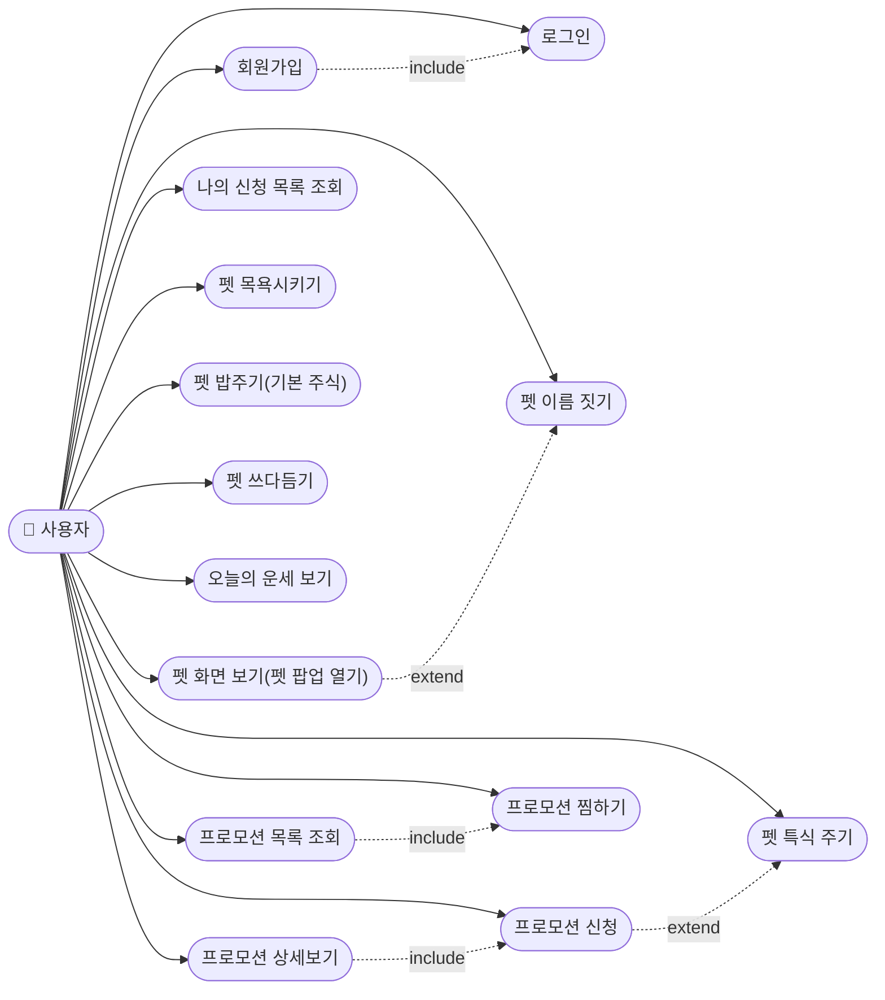

# 유스케이스 다이어그램: b2b-promo

`1-domain-definition.md` 기준. 담당자는 예외 상황에서만 등장(신청 취소/기간 종료 안내)이라 별도 액터로 두지 않고, 실행 주체는 사용자 1명.

## 관계 설명
- **UC3(목록 조회) include UC6(찜하기)**: 찜 버튼은 목록 화면에도 노출되어 조회 중 바로 토글 가능
- **UC4(상세보기) include UC5(신청)**: 상세보기에서 신청 버튼으로 이어짐
- **UC5(신청) extend UC9b(특식 주기)**: 신청을 완료하면 그 프로모션의 특식을 보유하게 되어, 이후 "밥"과 별개 버튼인 "특식 주기"로 급여할 수 있게 확장됨
- **UC1(회원가입) include UC2(로그인)**: 가입 직후 자동 로그인 처리(펫 1마리 자동 생성)
- **UC12(펫 화면 보기) extend UC2b(펫 이름 짓기)**: 로그인은 항상 프로모션 목록으로 이동하고(분기 없음), 펫 이름이 없는 상태(최초 로그인/사망·성체 순환으로 새 알이 생겼을 때)에서 펫 팝업을 처음 열면 그 안에서 이름 짓기 폼이 확장되어 나타남(별도 화면/라우팅 아님, PetPanel.jsx)

## 유스케이스 ↔ 도메인 규칙 참조
| 유스케이스 | 관련 섹션 |
|---|---|
| 회원가입/로그인 | 1-domain-definition.md 1번 개요, 3번 사용자 엔티티 |
| 펫 이름 짓기 | 6번 비즈니스 규칙(펫 이름 짓기) |
| 프로모션 목록/상세/신청/찜 | 3번 프로모션·신청·찜 엔티티, 7번 예외 상황 |
| 펫 목욕/밥주기/특식 주기/쓰다듬기 | 5.1 단계별 행동·상태 정리 |
| 오늘의 운세 | 5번 상태 - 오늘의 운세 규칙 |
