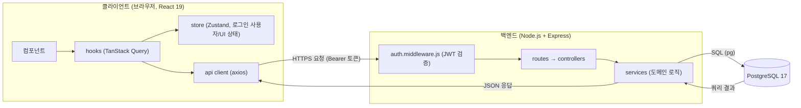
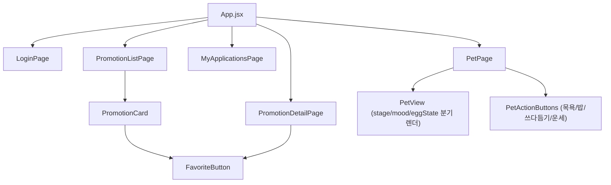

# 기술 아키텍처 다이어그램: b2b-promo

기반 문서: `docs/3-PRD.md`(4장 기술 스택), `docs/6-project-principle.md`(6장 프론트/7장 백엔드 레이어)
전제: 1인 개발, 3일 일정, 오버엔지니어링 금지 — 문서에 없는 인프라(로드밸런서, 캐시 서버, 메시지 큐 등)는 그리지 않는다.

## 프론트엔드 컴포넌트 구조

`docs/6-project-principle.md` 6장의 디렉토리 구조를 그대로 트리로 표현.

- 라우트 단위 화면(`pages/`)이 최상위, 재사용 컴포넌트(`components/`)는 화면 안에서 조합된다.
- `FavoriteButton`은 목록/상세 어디서나 동일하게 재사용(찜 토글은 위치와 무관하게 즉시 반영).
- `PetView`는 `stage`(알/새끼/성체/묘비) · `mood`/`eggState`로 분기해 스프라이트를 그리는 단일 컴포넌트로 유지하고 잘게 쪼개지 않는다(project-principle.md 6장 원칙).

## 설명

- **컴포넌트 → hook → api client**: 컴포넌트는 axios를 직접 호출하지 않고 TanStack Query 훅을 통해서만 서버 상태에 접근한다.
- **store(Zustand)**: 서버 상태는 복제하지 않고, 로그인 사용자 정보/UI 토글 같은 클라이언트 전역 상태만 담당한다.
- **auth.middleware.js**: 모든 요청은 먼저 JWT 액세스 토큰 검증을 거쳐 `req.user`가 세팅된 뒤 라우트로 전달된다.
- **routes → controllers → services**: 라우트/컨트롤러는 요청 파싱과 응답만 담당하고, 도메인 로직(프로모션 신청, 펫 상태 전이 등)은 전부 services에 있다.
- **services → PostgreSQL 17**: `pg`로 직접 SQL을 작성해 쿼리하며, ORM이나 별도 캐시 계층을 두지 않는다.
