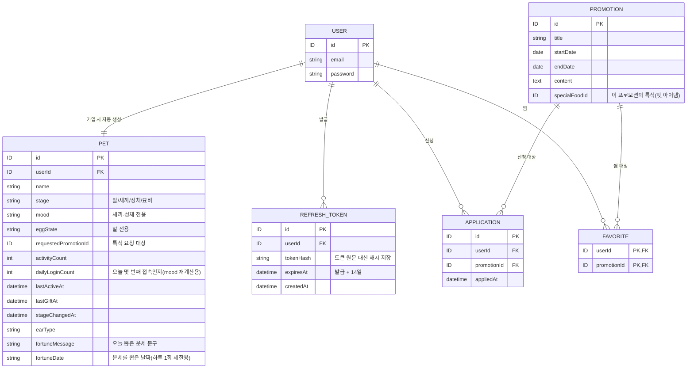

# ERD: b2b-promo

기반 문서: `docs/1-domain-definition.md` 3장(엔티티) · 4장(관계), `docs/3-PRD.md` 6장(데이터 모델)

## 엔티티 설명
- **USER**: 이메일/비밀번호로 가입하는 사용자(거래처 담당자) 계정.
- **REFRESH_TOKEN**: 발급된 리프레시 토큰(해시)의 저장소. 로그아웃·강제 만료 시 해당 행을 삭제해 즉시 무효화한다. 별도 revoked 플래그는 두지 않고 행 삭제로 처리.
- **PROMOTION**: 회사가 등록하는 신청 가능한 프로모션 상품/이벤트.
- **APPLICATION**: 사용자가 특정 프로모션에 신청한 이력.
- **FAVORITE**: 사용자가 특정 프로모션을 찜(관심 표시)한 이력. userId+promotionId 복합키.
- **PET**: 사용자당 1마리 지급되는 다마고치 캐릭터. specialFoodId(프로모션의 특식)와는 신청/보유 로직으로 연결되며 별도 엔티티는 두지 않음.
